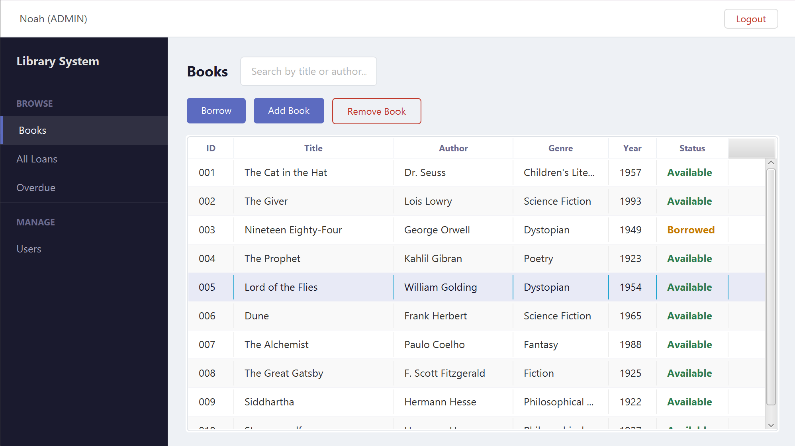

# Library Management System

A desktop library management application built with Java and JavaFX. Supports user authentication, role-based access control, book catalog management, and loan tracking with overdue detection.



## Features

- **User Authentication** - Login system with BCrypt password hashing, brute force protection (account lockout after 5 failed attempts), and session timeout after 15 minutes of inactivity.
- **Role-Based Access Control** - Two roles: Admin and Member. Admins can manage books, users, and view all loans. Members can browse books, borrow/return, and view their own loans.
- **Book Management** - Add, remove, search, and browse books. Books with active loans cannot be removed.
- **Loan Tracking** - Borrow and return books with automatic due date calculation (14 days). Filter loans by status (Active, Returned, All). Overdue loans are flagged and tracked separately.
- **Audit Logging** - All actions (login, borrow, return, add/remove) are logged to `data/audit.log` with timestamps and usernames.
- **Data Persistence** - All data is stored as JSON files using Gson, loaded on startup and saved on every change.

## Tech Stack

- Java 17+
- JavaFX 21 (GUI)
- Gson (JSON serialization)
- jBCrypt (password hashing)
- Maven (build and dependency management)

## Prerequisites

- [Java JDK 17+](https://www.oracle.com/java/technologies/downloads/)
- [Apache Maven 3.9+](https://maven.apache.org/download.cgi)

## Getting Started

1. Clone the repository:
```
git clone https://github.com/noahvz7/LibraryManagementSystem.git
cd LibraryManagementSystem
```

2. Install dependencies and compile:
```
mvn compile
```

3. Run `Launcher.java` from your IDE. Alternatively, from the command line:
```
mvn javafx:run
```

4. On first launch, you'll be prompted to create an admin account. After that, you can log in and start using the system.

## Project Structure

```
src/main/java/
  Main.java               - Application entry point
  Launcher.java           - IDE compatibility launcher
  model/
    Book.java             - Book data model
    Loan.java             - Loan data model
    User.java             - User data model (authentication + patron info)
  service/
    AuthService.java      - Login, registration, session management
    LibraryService.java   - Book and loan operations
  ui/
    LoginScreen.java      - Login and registration screen
    Dashboard.java        - Main layout with sidebar navigation
    BooksPane.java        - Book catalog view
    LoansPane.java        - Loan management view
    OverduePane.java      - Overdue loan tracking
    UsersPane.java        - User management (admin only)
  util/
    AuditLogger.java      - Action logging
    Constants.java        - Centralized configuration values
    DataManager.java      - JSON file I/O
    LocalDateAdapter.java - Gson adapter for Java date types
    Validator.java        - Input validation
```

## Security Concepts

This project implements several cybersecurity fundamentals:

- **Password Hashing** - BCrypt with random salting, intentionally slow to resist brute force attacks.
- **Input Validation** - All user input is checked for length, format, and content before processing.
- **Brute Force Protection** - Accounts are temporarily locked after 5 consecutive failed login attempts.
- **Session Management** - Sessions expire after 15 minutes of inactivity.
- **Role-Based Access Control** - Principle of least privilege, users only access what their role allows.
- **Audit Logging** - All user actions are recorded for traceability.
- **Foreign Key Integrity** - Books and users with active loans cannot be deleted.

## About

Built as a personal project for learning Java, JavaFX, and cybersecurity concepts during first-year Computer Science.
